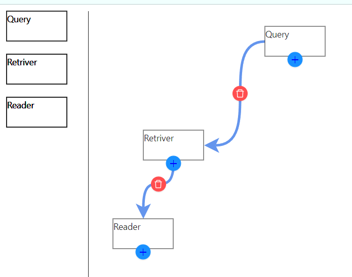

# PIPELINE BUILDER



## Functionality

- drag and drop configuration boxes
- create connections with lines
- remove connections

## Built with

 Vite, Typescript, React, emotion, antd

## How to run

- clone the re

- install deps

```bash
  npm i
```

- Run in dev mode

```bash
  npm run start
```

- application is accessible on [http://localhost:3000/](http://localhost:3000/)
